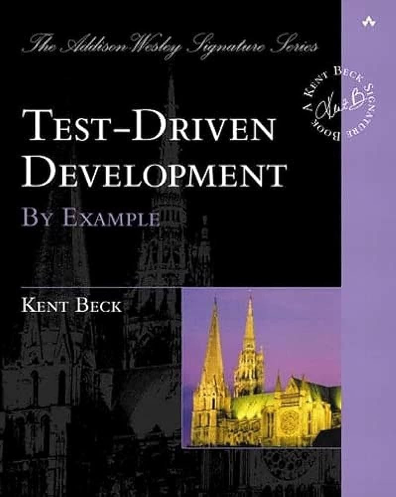
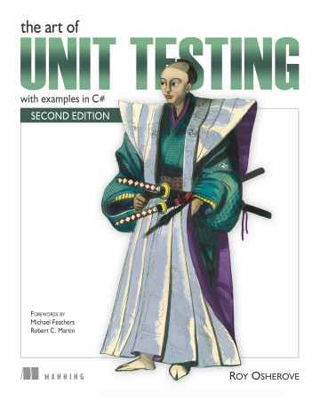

## What is Unit Testing ?
Unit testing definition [Wikipedia](https://en.wikipedia.org/wiki/Unit_testing#Unit).
> Unit would be the smallest component that can be isolated within the complex structure of an app. It could be a function, a subroutine, a method or property.
---
## Books

| | |
|:--:|--|
|  <!-- .element height="100px" --> | **Test-Driven Development - Kent Beck (2002)** |
|  <!-- .element height="100px" --> | The Art of Unit Testing - Roy Osherove (2014) |

---

## Talks

| | |
|:--:|--|
| <!-- .element width="300px" --> | [Does TDD Really Lead to Good Design? - Sandro Mancuso (2018)](https://www.youtube.com/watch?v=KyFVA4Spcgg) |
|  <!-- .element width="300px" --> | [TDD, Where Did It All Go Wrong - Ian Cooper (2017)](https://www.youtube.com/watch?v=EZ05e7EMOLM) |
